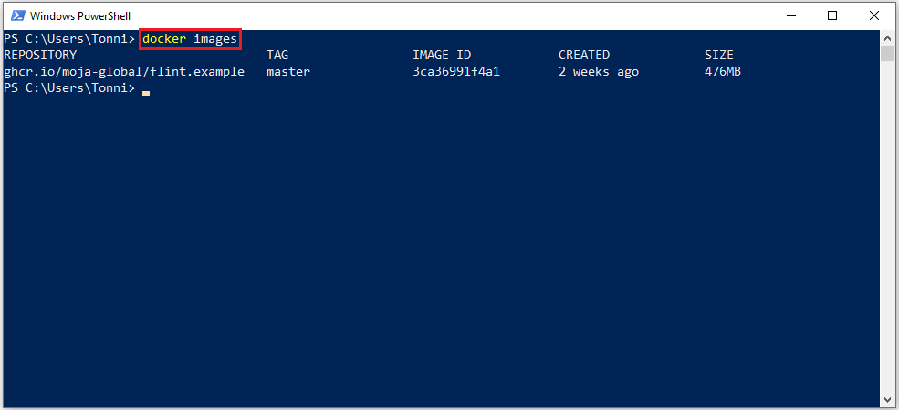

# FOREST MODULE: SET UP & RUN GUIDE

## 1. INTRODUCTION

This guide explores the steps necessary to set up and run a FLINT forest module based on the Chapman-Richards growth function. The Chapman-Richards growth function is a popular model for describing the growth of various tree and forest stand growth variables e.g. tree and stand height, diameter at breast height, basal area and volume.

**Objectives**  
To elucidate the steps necessary:  
a) To deploy the forest module    
b) To run the forest module  
c) To view the forest module's result

**Audience**  
This document was written for users who are capable of executing basic commands from a command-line terminal.  
Further, it was written from Window's Operating System Point Of View, but, the steps covered should loosely apply to any other operating system.

&nbsp;
## 2. REQUIREMENTS

### 2.1. Minimum Hardware Requirements

* Intel Core i7 Processor, with Virtualization Support,   
* 16GB RAM  
* 1TB Hard Drive 

&nbsp;
> Refer to the following guides to check if your hardware meets these minimum requirements:
>
> * [Annex A1 : Checking Processor Capacities](#annexA1)
> * [Annex A2 : Checking RAM Capacities](#annexA2)
> * [Annex A3 : Checking Hard Drive Capacities](#annexA3)
> * [Annex A4 : Checking Virtualization Support](#annexA4)

&nbsp;
### 2.2. Minimum Operating System Requirements 

* Windows 10 Pro, Latest Version, or   
* Windows 10 Enterprise, Latest Version 

&nbsp;
> Refer to the following guides to check if your operating system meets these minimum requirements:
>
> * [Annex C1 : Checking Windows Editions](#annexC1)
> * [Annex C2 : Checking Windows Versions Build Numbers](#annexC2)
>
> Please note that the information on the latest build of Windows 10 can be obtained from the page below:
> 
> [Windows 10 and Windows Server 2019 update history](https://support.microsoft.com/en-us/help/4464619/windows-10-update-history)

&nbsp;
### 2.3. Third Party Software Requirements

* Python 3
* Docker  
* QGIS  
* SQLiteStudio
* Notepad++

> See the next section for instructions on downloading and setting up these software

&nbsp;
## 3. STEPS

### 3.1. Environment Preparation

### 3.1.1. Hardware Preparation

#### 3.1.1.1 Firmware Virtualization

i.  Check if the Firmware Virtualization is enabled    
ii. Enable it if not 

&nbsp;
> Use the following guides as references for carrying out the above task:
>
> * [Annex A5 : Checking Firmware Virtualization Enablement Statuses](#annexA5)
> * [Annex B1 : Enabling Firmware Virtualization](#annexB1)

&nbsp;
### 3.1.2. Operating System Preparation

#### 3.1.2.1. Windows Edition / Version

i.  Check if the Windows Edition / Version is the latest    
ii. Update it if not 

&nbsp;
> Use the following guides as references for carrying out the above task:
>
> * [Annex C1 : Checking Windows Editions](#annexC1)
> * [Annex C2 : Checking Windows Versions / Build Numbers](#annexC2)
> * [Annex D1 : Updating Windows to the latest versions](#annexD1)
>
> Please note that the information on the latest build of Windows 10 can be obtained from the page below:
> 
> [Windows 10 and Windows Server 2019 update history](https://support.microsoft.com/en-us/help/4464619/windows-10-update-history)

&nbsp;
#### 3.1.2.2. Administrative Rights

i.  Check if the logged in user account has administrative rights    
ii. Switch to an account that has administrative rights if not

&nbsp;
> Use the following guide as reference for carrying out the above task:
>
> * [Annex C4 : Checking whether a user account has administrative privileges](#annexC4)

&nbsp;
#### 3.1.2.3. Account Password

i.  Check if the logged in user account has a password    
ii. Set it if not 

&nbsp;
> Use the following guides as references for carrying out the above task:
>
> * [Annex C5 : Checking whether a user account has a password](#annexC5)
> * [Annex D2 : Adding a password to a user account](#annexD2)

&nbsp;
#### 3.1.2.4. Windows Hyper-V Features

i.  Check whether Windows Hyper-V Features have been turned on    
ii. Turn them on if not 

&nbsp;
> Use the following guides as references for carrying out the above task:
>
> * [Annex C6 : Checking whether Windows Hyper-V Features have been turned on](#annexC6)
> * [Annex D3 : Turning on Windows Hyper-V Features](#annexD3)

&nbsp;
#### 3.1.2.5. Port 445

i.  Check whether Port 445 is open for TCP connections    
ii. Open it if not 

&nbsp;
> Use the following guides as references for carrying out the above task:
>
> * [Annex C7 : Checking if port 445 is open for TCP connections](#annexC7)
> * [Annex D4 : Opening port 445 for TCP connections](#annexD4)

&nbsp;
### 3.2. Third Party Software Installation

#### 3.2.1. Python 3

##### (a) Pre Installation

01. Go to [Python Downloads](https://www.python.org/downloads/) page
02. Download the latest Python release for Windows

##### (b) Steps

> The following installation steps were written with reference to Python 3.8.2

01. Right click the Python installer and select Run as administrator
02. Select Customize installation to custom-install Python
03. Leave the default Optional Features selected and click Next
04. Leave the default Advanced Options selected
05. Change the install location to C:\Python38
06. Click Install
07. Disable the 260 characters max path length limit
08. Click Close to exit the installer

&nbsp;
#### 3.2.2. Docker

##### (a) Pre Installation

01. Complete the hardware preparation instructions as described earlier
02. Complete the operating system preparation instructions as described earlier
03. Go to [Docker Desktop Downloads](https://www.docker.com/products/docker-desktop) page
04. Download the Docker Desktop installer for Windows 

##### (b) Steps

> The following installation steps were written with reference to Docker Desktop 2.2.0.3

01. Right click the Docker Desktop installer and select **Run as administrator**
02. Wait for Docker Desktop to download the required packages
03. Leave the first checkbox checked to add a Docker Desktop shortcut to your desktop
04. Click **OK** to proceed
05. Wait for Docker Desktop to unpack its files and install
06. Click **Close** to exit the installation

##### (c) Post Installation

> The following configuration steps were written with reference to Docker Desktop 2.2.0.3

01. Double click the **Docker Desktop Shortcut** to start it
02. Wait for Docker Desktop to notify you that its up and running and then proceed to the next step
03. Go to the System Tray  and click the Docker Desktop icon 
04. Select **Settings** on the pop-up menu
05. Select the **Resources** menu on the Settings Window
06. Click the **Advanced** Resource subcategory if not currently selected
07. Increase the **Memory** available to Docker to at least 4GB
08. Click the **File Sharing** Resource subcategory
09. Select drive **C:\** as the local drive you want to be available to your containers
10. Click **Apply & Restart** to save the changes
11. Close the settings window after Docker Desktop successfully restarts

&nbsp;
#### 3.2.3. QGIS

##### (a) Pre Installation

01. Go to [QGIS Downloads](https://qgis.org/en/site/forusers/download.html) page
02. Download the latest QGIS Standalone Installer for Windows - from OSGeo4W packages 

##### (b) Steps

> The following installation steps were written with reference to QGIS 3.12.1 'Bucureșt'

01. Right click the QGIS installer and select **Run as administrator**
02. Click **Next** to confirm that you want to proceed with the installation
03. Acknowledge the license terms
04. Leave the install path unchanged to install QGIS in the default location; click **Next**
05. Leave the selected features unchanged to install the default components; click **Install**
06. Click **Finish** to complete the installation

&nbsp;
#### 3.2.4. SQLiteStudio

##### (a) Pre Installation

01. Go to [SQLiteStudio Downloads](https://github.com/pawelsalawa/sqlitestudio/releases) page
02. Download the latest binary release of SQLiteStudio for Windows

##### (b) Steps

> The following installation steps were written with reference to SQLiteStudio 3.2.1

01. Right click the SQLiteStudio installer and select **Run as administrator**
02. Click **Next** to confirm that you want to proceed with the installation
03. Leave the install path unchanged to install SQLiteStudio in the default location
04. Leave the other settings as they are
05. Click **Next**
06. Leave the selected components unchanged -  to install Qt and SQLiteStudio; click **Next**
07. Click **Install** to carry out the installation
08. Uncheck the **Run SQLiteStudio** option and Click Finish to complete the installation

&nbsp;
#### 3.2.5. Notepad++

##### (a) Pre Installation

01. Go to [Notepad++ Downloads](https://notepad-plus-plus.org/downloads/) page
02. Download the latest binary release of Notepad++ for Windows

##### (b) Steps

> The following installation steps were written with reference to Notepad++ 7.8.5

01. Right click the Notepad++ installer and select **Run as administrator**
02. Leave **English** as the selected language and click OK
03. Click **Next** to confirm that you want to proceed with the installation
04. Acknowledge the license terms and Click **Next**
05. Leave the install path unchanged to install Notepad++ in the default location; click **Next**
06. Leave the selected features unchanged to install the default components; click **Next**
07. Click **Install** to carry out the installation
08. Click **Finish** to complete the installation

&nbsp;
### 3.2. Forest Module Deployment

> The Forest Module has been packaged in a Docker Image containing sample FLINT Modules.  
> Thus to deploy it, one only needs to obtain the FLINT Example Docker Image and set up its runtime environment.  
> This section assumes that **Docker** has already been set up as previously described.

### 3.2.1. Docker Image Setup

01. Search for **Windows PowerShell** and open it
> 

02. Pull the **FLINT Examples Image** from **Moja's Container Registry** by executing the following command:  
> docker pull ghcr.io/moja-global/flint.example:master
>
> 

03. Confirm the image was successfully pulled by executing the following command:   
> docker images
>
> 

### 3.2.2. Runtime Environment Setup  

01. Go to Moja Global's [**FLINT Example**](https://github.com/moja-global/FLINT.Example) Github Page  
> 

02. Click and expand the **Code** dropdown  
> 

03. Click **Download Zip** to download the FLINT Example Code to your workstation
> 

04.  Go to your Workstation's **Downloads Folder** and locate the downloaded **FLINT.Example-master** zip
> 

05. Right click the **FLINT.Example-master** zip and select **Extract All** 
> 

06. Leave the destination unchanged and click **Extract** to extract the contents into the **Downloads Folder**
> 

07. Open the extracted folder to view its contents
> 

08. Right click and copy the **Run_Env** folder
> 

09. Open your **C:\ Drive** and then right click and paste the **Run_Env** folder into it
> 

&nbsp;
### 3.3. Forest Module Operation

Once you've successfully deployed the Forest Module you can carry out Point-Based and Spatial simulations.

#### 3.3.1. Point-Based Simulations

> **Point-Based Simulations** are simulations that run off configuration files, rather than spatial data.  
> They are normally used to test features or datasets.

3.3.1.(a) Configuring Point-Based Simulations:

01. Go to the **Run_Env** directory in your **C:\ Drive**  
>  
>
> 
>  
02. Open the **config** subdirectory of the **Run_Env** directory  
>  
>
> 
>  
03. Right click the **point_forest_config.json** file in the **config** subdirectory & select **Edit with Notepad++**  
>  
>
> 
>  
04. Edit and save the configuration file

&nbsp;
3.3.1.(b) Running Point-Based Simulations:

01. Search for **Windows PowerShell** and open it
> 

02. Start a container from the FLINT Example image by entering the following command:  
> docker run --rm -v C:/Run_Env:/usr/local/run_env -ti ghcr.io/moja-global/flint.example:master
>
> 
> 
> It's perhaps important to note that the **-v** option in the above command maps the locally set **Run Environment** to the container's **Run Environment** (located under the **/usr/local** directory)

03. Change the container's working directory to **/usr/local/run_env** by entering the following command:  
> cd /usr/local/run_env
>
> 
> 

04. Launch the point-based simulation by entering the following command:  
> moja.cli --config config/point_forest_config.json --config config/libs.base_forest.simple.json
>
> 
> 

05. The point-based simulation should run and display its results on the terminal:  
> The results should include the following fields: notification, step, stepDate, fracOfStep, stepLenInYears, initialValues, atmosphereCM, aboveGroundCM, belowGroundCM
>
> 
>

#### 3.3.2. Spatial Simulations

> **Spatial Simulations** are simulations that run off spatial data. 
> Spatial data are typically fed into the FLINT in 0.1 x 0.1 spatial degrees units known as **Blocks**. 
> Blocks are then assembled to form **Tiles**: Spatial units that are 1 x 1 degrees large (meaning they can fit 100 blocks at maximum). 
> Finally, Tiles are assembled to form the entire spatial extent being simulated. 
 

3.3.2.(a) Configuring Spatial Simulations:

01. Go to the **Run_Env** directory in your **C:\ Drive**  
>  
>
> 
>  
02. Open the **config** subdirectory of the **Run_Env** directory  
>  
>
> 
>  
03. Right click the **forest_config.json** file in the **config** subdirectory & select **Edit with Notepad++**  
>  
>
> 
>  
04. Edit and save the configuration file

&nbsp;
3.3.2.(b) Running Spatial Simulations:

01. Search for **Windows PowerShell** and open it
> 

02. Start a container from the FLINT Example image by entering the following command:  
> docker run --rm -v C:/Run_Env:/usr/local/run_env -ti ghcr.io/moja-global/flint.example:master
>
> 
> 
> It's perhaps important to note that the **-v** option in the above command maps the locally set **Run Environment** to the container's **Run Environment** (located under the **/usr/local** directory)

03. Change the container's working directory to **/usr/local/run_env** by entering the following command:  
> cd /usr/local/run_env
>
> 
> 

04. Launch the spatial simulation by entering the following command:  
> moja.cli --config config/forest_config.json --config config/libs.gdal.chaprich.json --config_provider config/forest_provider.json
>
> 
> 

05. The spatial simulation should run and display the results at **Block**, **Tile** and **Full Run** levels:  
>  
>
> 
>

&nbsp;
3.3.2.(c) Merging Spatial Simulations Results:  
> Outputs are usually generated for each Block that has been included in a Spatial Run.  
> Typically, these include spatial (.TIFF) and database (.SQL) files.  
> These outputs should be merged together to create meaningfully analyzable resultsets.

01. Following the successful execution of a spatial run, enter the following command to merge the block-level outputs  
> python3 ./merge_geotiffs.py --run_id ""
>
> 
> 

02. This should group spatial data from each pool / timestep into a single file  
>  
>
> 
> 
 

&nbsp;
3.3.2.(d) Viewing Spatial Results From The Run:  

01. Search for **QGIS Desktop** and open it  
>  
>
> 
> 

02. In the QGIS browser, locate and open the desired **raster** from the from the **Run_Env Output Folder** 
>  
>
> 
> 

&nbsp;
3.3.2.(e) Viewing Database Results From The Run:  

01. Search for **SQLiteStudio** and open it  
>  
>
> 
> 

02. Under the **Database** menu, select **Add a Database** 
>  
>
> 
> 

03. Click **Browse for existing database file on local computer**
>  
>
> 
> 

04. Locate and open the SQLite output from the from the **Run_Env Output Folder** 
>  
>
> 
> 

05. Click **OK** 
>  
>
> 
> 

06. Double-Click and explore the **Output** Database 
>  
>
> 
> 

&nbsp;
##  ANNEXES

&nbsp;
### Annex A : Hardware Audits Reference

&nbsp;
#### <a name="annexA1">Annex A1: Checking Processor Capacities</a>

01. Open the Windows search tool
02. Search for the **System Information** tool and open it
03. Select **System Summary** menu on the **System Information** window
04. Look for the **Processor** specification on the right pane

&nbsp;
#### <a name="annexA2">Annex A2: Checking RAM Capacity</a>

01. Open the Windows search tool
02. Search for the **System Information** tool and open it
03. Select **System Summary** menu on the **System Information** window
04. Look for the **Physical Memory** specification on the right pane

&nbsp;
#### <a name="annexA3">Annex A3: Checking Hard Drive Capacity</a>

01. Open the Windows search tool
02. Search for the **System Information** tool and open it
03. Expand the **Components** category in the **System Information** window
04. Expand the **Storage** subcategory under the **Components** category
05. Click the **Disks** subcategory under the **Storage** subcategory
06. Click the **Size** specifications under the disk descriptions

&nbsp;
#### <a name="annexA4">Annex A4: Checking Virtualization Support</a> 

01. Open the Windows search tool
02. Search for the **Task Manager** tool and open it
03. Open the **Performance** tab on the opened window _(You might need to click on **More Details** first to see this)_
04. Look for a line that says **"Virtualization: (En/Dis)abled"** on the bottom-right side of the opened tab

&nbsp;
#### <a name="annexA5">Annex A5 : Checking Firmware Virtualization Enablement Status</a>

01. Open the Windows 10 search tool
02. Search for the Task Manager tool and open it
03. Open the **Performance** tab on the opened window _(You might need to click on **More Details** first to see this)_
04. Look for a line that says “Virtualization: Enabled” on the bottom-right side of the opened tab

&nbsp;
### Annex B : Hardware Configurations Reference

&nbsp;
#### <a name="annexA4">Annex B1 : Enable Firmware Virtualization</a> 

01. Restart the PC
02. Press the key required to enter BIOs (See [Appendix 1](#appendix1))
03. Navigate to either the Advanced Security or the Systems Configurations tab
04. Select Virtualization or Virtualization Technology and then press the Enter key  
05. Select Enabled and then press the Enter key
06. Press the F10 key then select the Yes option
07. Press the Enter key to save the changes and Reboot 

&nbsp;
### Annex C : Operating System Audits Reference

&nbsp;
#### <a name="annexC1">Annex C1 : Checking Windows Editions</a>

01. Open the Windows search tool
02. Search for the **System Information** tool and open it
03. Select the **System Summary** menu on the **System Information** window
04. Look for the **OS Name** specification on the right pane

&nbsp;
#### <a name="annexC2">Annex C2 : Checking Windows Versions / Build Numbers</a>

01. Open the Windows search tool
02. Search for the **System Information** tool and open it
03. Select the **System Summary** menu on the **System Information** window
04. Look for the **Version** specification on the right pane

&nbsp;
#### <a name="annexC3">Annex C3 : Checking for the latest Windows Operating System</a>

01. Open [this wikipedia page](https://en.wikipedia.org/wiki/List_of_Microsoft_Windows_versions)
02. Look for the latest **Windows Version, Edition and Build Number**

&nbsp;
#### <a name="annexC4">Annex C4 : Checking whether a user account has administrative privileges</a>

01. Open the Windows 10 search tool
02. Search for the **Manage your account** tool and open it
03. Look for the word **"Administrator"** underneath the **account name**

&nbsp;
#### <a name="annexC5">Annex C5 : Checking whether a user account has a password</a>

01. Open the Windows 10 search tool
02. Search for the **Manage your account** tool and open it
03. Click the **Sign-in Options** on the left pane of the opened window
04. Scroll down to the **Password** section on the right pane of the opened window
05. Look for a statement that says **"Sign in with your account’s password"** underneath it

&nbsp;
#### <a name="annexC6">Annex C6 : Checking whether Windows Hyper-V features are turned on</a>

01. Open the Windows 10 search tool
02. Search for the **Turn Windows features on or off** tool and open it
03. Locate the **Hyper-V** section and find out if it’s checked

&nbsp;
#### <a name="annexC7">Annex C7 : Checking if port 445 is open for TCP connections</a>

01. Open the Windows 10 search tool
02. Search for the **Windows Defender Firewall** tool and open it
03. Click **Advanced settings** on the left pane of the **Windows Defender Firewall** window
04. Click the **Inbound Rules** category on the left pane of the newly popped up window
05. Locate the **Local Port** column on the newly opened **Inbound Rules** table
06. Scroll down this **Local Port** column and see whether there’s a TCP entry for port 445
07. Click the **Outbound Rules** category on the left pane of the newly popped up window
08. Locate the **Remote Port** column on the newly opened **Outbound Rules** table
09. Scroll down this **Remote Port** column and see whether there’s a TCP entry for port 445

&nbsp;
## Annex D : Operating System Configurations Reference

&nbsp;
#### <a name="annexD1">Annex D1 : Updating Windows to the latest version</a>

01. Go to [Download Windows 10](https://www.microsoft.com/en-us/software-download/windows10)
02. Click the Update now button to download the Windows 10 Update Assistant
03. Right click the downloaded Windows 10 Update Assistant and select Run as administrator 
04. Click Update Now on the newly opened window
05. Click Next after the PC is ascertained as being compatible with the update
06. Click Minimise to optionally have the update run in the background
07. Click Restart now to restart your PC when the update is complete

&nbsp;
#### <a name="annexD2">Annex D2 : Adding a password to a user account</a>
01. Open the Windows 10 search tool
02. Search for the **Manage your account** tool and open it
03. Click the **Sign-in options** on the left pane of the opened window
04. Scroll down to the **Password** section on the right pane of the opened window
05. Click the **Add** button underneath it
06. Enter the password and password hint details and click **Next**
07. Click **Finish**

&nbsp;
#### <a name="annexD3">Annex D3 : Turning on Windows Hyper-V features</a>
01. Open the Windows 10 search tool
02. Search for the **Turn Windows features on or off** tool and open it
03. Locate the **Hyper-V** section
04. Check it and click **OK**
05. Click **Restart now** to finish installing the requested changes

&nbsp;
#### <a name="annexD4">Annex D4 : Opening port 445 for TCP connections</a>
01. Open the Windows 10 search tool
02. Search for the **Windows Defender Firewall**  tool and open it
03. Click **Advanced settings** on the left pane of the **Windows Defender Firewall** window
04. Click the **Inbound Rules** category on the leftmost pane of the newly popped up window
05. Click the **New Rule** option on the rightmost pane of the newly popped up window
06. Select **Port** as the type of rule to be created
07. Click **Next**
08. Select **TCP** as the protocol of the rule to created
09. Select **Specific local ports** and enter **445** as the port that the rule should be apply to
10. Click **Next**
11. Select **Allow the connection** as the action to take when a connection matches the conditions
12. Check **Domain, Private and Public** to have the rule apply to each of these profiles
13. Click **Next**
14. Enter **Docker** as the name of the rule and click **Finish**
15. Repeat Steps 4 to 14 for **Outbound Rules**

&nbsp;
##  APPENDICES

&nbsp;
### <a name="appendix1">Appendix 1: Keys required to access BIOS settings</a> 

| Manufacturer | F1  | F2  | F3  | F6  | F10 | F11 | F12 | ESC | INS | DEL |
| ------------ | --- | --- | --- | --- | --- | --- | --- | --- | --- | --- |
|  Acer        |  A  |  C  |     |     |     |     |     |     |     |  C  |
|  Asus        |     |  C  |     |     |     |     |     |     |  A  |  A  |
|  DELL        |  A  |  C  |  A  |     |     |     |  A  |     |     |  A  |
|  HP          |  A  |  A  |     |  A  |  C  |  A  |  A  |  C  |     |     |
|  Lenovo      |  C  |  C  |     |     |     |     |     |     |     |     |
|  Sony        |  A  |  C  |  C  |     |     |     |     |     |     |     |
|  Toshiba     |  A  |  C  |     |     |     |     |     |  A  |     |     |

_Where C = Most Common and  A = Alternative_
