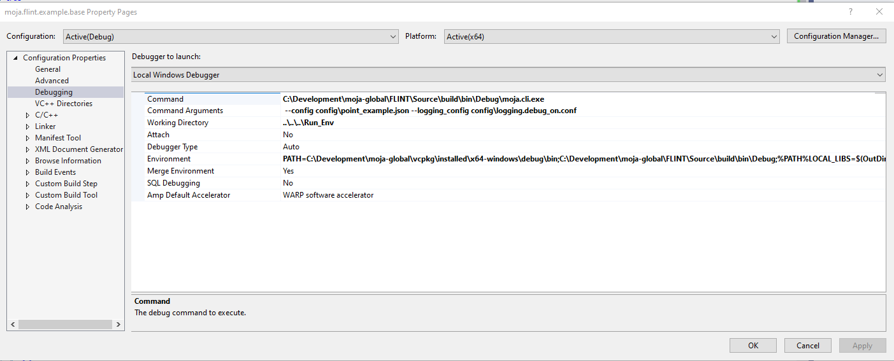

# FLINT.example
[](#contributors)

This project gives an example of how to build and run libraries using the FLINT framework.

There are 3 different environemnts listed in this document to build and run the examples:

* [Windows - Visual Studio 2019](#environment-visual-studio-16-2019-win64): *develop, run and debug*
* [Visual Studio Code](#environment-visual-studio-code): *develop, run and debug*
* [Docker](#environment-docker): *run only*

and currently four different sample runs:

* Test Module sample at point level
* RothC sample at point level
* Chapman richards Point sample
* Chapman richards Spatial sample

## **Environment**: Visual Studio 16 2019 Win64

### Building the project

Assuming you have followed the moja flint documentation to build using the vcpkg method, the commands below should build your example project solution.

**NOTE**: Paths used in commands may be different on your system.

```powershell
# Create a build folder under the Source folder
mkdir -p Source\build
cd Source\build

# Run one of the generate commands below
# Point simulations
# Generate the project files
cmake -G "Visual Studio 16 2019" -DCMAKE_INSTALL_PREFIX=C:\Development\Software\moja -DVCPKG_TARGET_TRIPLET=x64-windows -DOPENSSL_ROOT_DIR=c:\Development\moja-global\vcpkg\installed\x64-windows -DENABLE_TESTS=OFF -DCMAKE_TOOLCHAIN_FILE=c:\Development\moja-global\vcpkg\scripts\buildsystems\vcpkg.cmake ..

# Spatial simulations
# if your planning to run spatial chapman richards example you also need to enable the gdal module
# Generate the project files
cmake -G "Visual Studio 16 2019" -DCMAKE_INSTALL_PREFIX=C:\Development\Software\moja -DVCPKG_TARGET_TRIPLET=x64-windows -DOPENSSL_ROOT_DIR=c:\Development\moja-global\vcpkg\installed\x64-windows -DENABLE_TESTS=OFF -DENABLE_MOJA.MODULES.GDAL=ON -DCMAKE_TOOLCHAIN_FILE=c:\Development\moja-global\vcpkg\scripts\buildsystems\vcpkg.cmake ..

```

### Running the project

Running in the IDE and debugging is a little tricky. This could more than likely be resolved with better cmake  setups. But for now there is some setup that can make running and debugging work.

The issue is we want to run with the `moja.cli.exe` from the moja.FLINT project, but debug in our current IDE (FLINT.example).

The solution is to use properties to setup a Debug run in the IDE, making the command run `moja.cli.exe`.

**NOTE** : All paths used below with `C:\Development\moja-global` will need to be modified to match your system build location of the moja project.



#### Test Module Example

The settings required in VS2019 are:

```
# Command
C:\Development\moja-global\FLINT\Source\build\bin\$(Configuration)\moja.cli.exe

# Command Args
--config config\point_example.json --config config\$(Configuration)\libs.base.win.json  --logging_config logging.debug_on.conf
 
# Working Directory
$(SolutionDir)\..\..\Run_Env

# Environment Debug
PATH=C:\Development\moja-global\vcpkg\installed\x64-windows\debug\bin;C:\Development\moja-global\FLINT\Source\build\bin\$(Configuration);%PATH%
LOCAL_LIBS=$(OutDir)
MOJA_LIBS=C:\Development\moja-global\FLINT\Source\build\bin\$(Configuration)

# Environment Release
PATH=C:\Development\moja-global\vcpkg\installed\x64-windows\bin;C:\Development\moja-global\FLINT\Source\build\bin\$(Configuration);%PATH%
LOCAL_LIBS=$(OutDir)
MOJA_LIBS=C:\Development\moja-global\FLINT\Source\build\bin\$(Configuration)

```

With Envs: `PATH` for various libraries built in the Moja stage and `LOCAL_LIBS` so we can modify the explicit path for our example config to load libraries from this vs build (the default is the same location as the EXE).

To match this, the example point config uses an environment variable in the library path:

```json
{
  "Libraries": {
    "moja.flint.example.base": {
      "library": "moja.flint.example.based.dll",
      "path": "%LOCAL_LIBS%",
      "type": "external"
    }
  }
}
```

#### RothC example

There is also a RothC example, to run that project use the same setup as below but change the command arguments:

```powershell
# Command Args
--config config/point_rothc_example.json --config config/$(Configuration)/libs.base_rothc.win.json --logging_config logging.debug_on.conf
```

#### Chapman Richards example

Based on the moja repository [Chapman Richards](https://github.com/moja-global/FLINT.chapman_richards), thsi sample can run both a point and spatial version (over Dominica).

```powershell
# Command Args
# Point
--config config/point_forest_config.json --config config/$(Configuration)/libs.gdal.chaprich.win.json
# Spatial
--config config/forest_config.json --config config/$(Configuration)/libs.gdal.chaprich.win.json --config_provider config/forest_provider.json
```

## **Environment**: Visual Studio Code

It is also possible to develop, run and debug in Visual Studio Code using Remote Containers. You will need to install [*Visual Studio Code*](https://code.visualstudio.com/) and add the extension:

* [*Remote - Container*](https://marketplace.visualstudio.com/items?itemName=ms-vscode-remote.remote-containers)

Others extensions may be required, please follow instructions during VS Code startup. Extensions required during development will be installed in the container (listed below).

With these extensions installed, on startup, *VS Code* should ask if you want to open the project in a Container - OR you can press `F1` and select `Remote-Containers: Open folder in Container...`

The *VS Code* project has some `launch.json` settings in place (in the `.vscode` folder), these can run both the base and rothc samples. It is possible to debug into the moja.flint libraries by loading on of the *.cpp/*.h files and setting a breakpoint - OR stepping into a method using the debugger

To build the project the cmake and C++ extensions will be required. These have been specified in the `devcontainer.json` file. To build the library use Cmake Configure, Buold and Install.

```json
	"extensions": [
		"ms-vscode.cpptools",
		"austin.code-gnu-global",
		"twxs.cmake",
		"ms-vscode.cmake-tools"
	]
```
Once the project opens the folder in the dev container, use the cmake commands to configure and build the project. Once this is done you should be ready to run/debug one of the samples.

NOTE: The libraries require a slightly different paths to work inside the dev-container, so there is a new version of the library configs for *VS Code*. These commands will work from the terminal in the running container after cmake has been successful.

```bash
# start in the correct folder
cd /workspaces/FLINT.example/Run_Env

# sample
moja.cli --config config/point_example.json --config config/libs.base.vscode.json  --logging_config logging.debug_on.conf

# rothc
moja.cli --config config/point_rothc_example.json --config config/libs.base_rothc.vscode.json  --logging_config logging.debug_on.conf

# Chapman Richards - forest point
moja.cli --config config/point_forest_config.json --config config/libs.gdal.chaprich.vscode.json 

# Chapman Richards - forest spatial 
moja.cli --config config/forest_config.json --config config/libs.gdal.chaprich.vscode.json --config_provider config/forest_provider.json
```

## **Environment**: Docker

Docker file can be found in the [Dockerfile](./Docker/Dockerfile)

Builds fom the image `mojaglobal/flint:bionic` which can be found in [docker hub](https://hub.docker.com/repository/docker/mojaglobal/flint/general)

##### Building the docker:

```bash
# from repository root folder
cd Docker
docker build --build-arg NUM_CPU=8 -t moja/flint.example:bionic .
```

##### Commands to run using docker - stock result written to screen and results files create (./Run_Env/*.csv):

```bash
# from repository root folder
docker run --rm -v $(pwd)/Run_Env:/usr/local/run_env -ti moja/flint.example:bionic bash -c "cd /usr/local/run_env/; moja.cli --config config/point_example.json --config config/libs.base.simple.json --logging_config logging.debug_on.conf"
docker run --rm -v $(pwd)/Run_Env:/usr/local/run_env -ti moja/flint.example:bionic bash -c "cd /usr/local/run_env/; moja.cli --config config/point_rothc_example.json --config config/libs.base_rothc.simple.json --logging_config logging.debug_on.conf"
```

##### Commands to run moja from within the docker - stock result written to screen and results files create (./Run_Env/*.csv):

```bash
docker run --rm -v $(pwd)/Run_Env:/usr/local/run_env -ti moja/flint.example:bionic bash
```

##### Then inside the running container:

```bash
cd /usr/local/run_env/
moja.cli --config config/point_example.json --config config/libs.base.simple.json --logging_config logging.debug_on.conf
moja.cli --config config/point_rothc_example.json --config config/libs.base_rothc.simple.json --logging_config logging.debug_on.conf
```

## Outputs

The runs above will create output files. While Stock values are output to the screen, there will also be some simplace CVS files created with both Stock and Flux values for the simulation.

```bash
Example_Point_Flux.csv
Example_Point_Stock.csv
Example_Rothc_Point_Flux.csv
Example_Rothc_Point_Stock.csv
```

## TODO

* Add a spatial example of RothC
  * Need sample rasters in FLINT ready format for some of the RothC required data.
  * Could write a smaple provider that access this data from a different format?
  * Can produce spatial outputs, make them available for viewing in QGis?

## How to Get Involved?  

moja global welcomes a wide range of contributions as explained in [Contributing document](https://github.com/moja-global/About-moja-global/blob/master/CONTRIBUTING.md) and in the [About moja-global Wiki](https://github.com/moja-global/.github/wiki).  


## FAQ and Other Questions  

* You can find FAQs on the [Wiki](https://github.com/moja.global/.github/wiki).  
* If you have a question about the code, submit [user feedback](https://github.com/moja-global/About-moja-global/blob/master/Contributing/How-to-Provide-User-Feedback.md) in the relevant repository  
* If you have a general question about a project or repository or moja global, [join moja global](https://github.com/moja-global/About-moja-global/blob/master/Contributing/How-to-Join-moja-global.md) and 
  * [submit a discussion](https://help.github.com/en/articles/about-team-discussions) to the project, repository or moja global [team](https://github.com/orgs/moja-global/teams)
  * [submit a message](https://get.slack.help/hc/en-us/categories/200111606#send-messages) to the relevant channel on [moja global's Slack workspace](mojaglobal.slack.com). 
* If you have other questions, please write to info@moja.global   
  

## Contributors

Thanks goes to these wonderful people ([emoji key](https://allcontributors.org/docs/en/emoji-key)):

<!-- ALL-CONTRIBUTORS-LIST:START - Do not remove or modify this section -->
<!-- prettier-ignore-start -->
<!-- markdownlint-disable -->
<table>
  <tr>
    <td align="center"><a href="http://moja.global"><br /><sub><b>moja global</b></sub></a><br /><a href="#projectManagement-moja-global" title="Project Management">📆</a></td>
    <td align="center"><a href="https://github.com/leitchy"><br /><sub><b>James Leitch</b></sub></a><br /><a href="https://github.com/moja-global/FLINT.example/commits?author=leitchy" title="Code">💻</a></td>
    <td align="center"><a href="https://github.com/malfrancis"><br /><sub><b>Mal</b></sub></a><br /><a href="https://github.com/moja-global/FLINT.example/commits?author=malfrancis" title="Code">💻</a></td>
    <td align="center"><a href="https://github.com/sjbcastro"><br /><sub><b>sjbcastro</b></sub></a><br /><a href="https://github.com/moja-global/FLINT.example/commits?author=sjbcastro" title="Documentation">📖</a></td>
    <td align="center"><a href="https://github.com/parth-gr"><br /><sub><b>Parth Arora</b></sub></a><br /><a href="https://github.com/moja-global/FLINT.example/commits?author=parth-gr" title="Documentation">📖</a></td>
  </tr>
</table>

<!-- markdownlint-enable -->
<!-- prettier-ignore-end -->
<!-- ALL-CONTRIBUTORS-LIST:END -->

This project follows the [all-contributors](https://github.com/all-contributors/all-contributors) specification. Contributions of any kind welcome!


## Maintainers Reviewers Ambassadors Coaches

The following people are Maintainers Reviewers Ambassadors or Coaches  

<table><tr> <td align="center"><a href="https://github.com/leitchy"><br /><sub><b>James Leitch</b></sub></a><br /><a href="https://github.com/moja-global/FLINT.example/commits?author=leitchy" title="Code">💻</a></td><td align="center"><a href="https://github.com/malfrancis"><br /><sub><b>Mal</b></sub></a><br /><a href="https://github.com/moja-global/FLINT.example/commits?author=malfrancis" title="Code">💻</a></td></tr></table>  

**Maintainers** review and accept proposed changes  
**Reviewers** check proposed changes before they go to the Maintainers  
**Ambassadors** are available to provide training related to this repository  
**Coaches** are available to provide information to new contributors to this repository  
